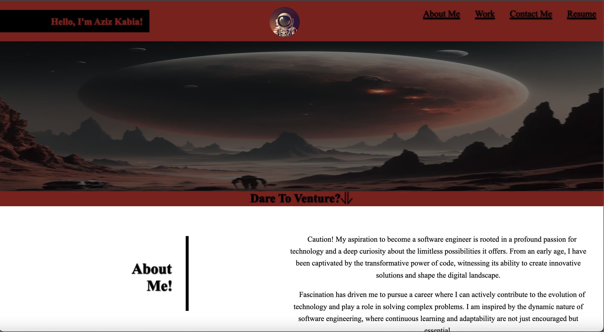

# Challenge-2

This repo is my challenge 2 assignment. The repo is for my online bootcamp at Vanderbilt University. The purpose of this repo was to create a webpage that can be used as a portfolio for my future assignments.

## Table of Contents 
N/A

## instalations 
N/A

## Usage: 

This repo will primarily be used by me to update projects I do during my bootcamp. However, for employers, it is used to show case how quickly I am grasping the fundamentals of HTML and CSS. Also, It will later consists of different projects that showcase my versatility throughout the bootcamp. 

visit the webpage to use:
https://aakabia.github.io/Challenge-2/

## Credits:

N/A

## License 

MIT License 

